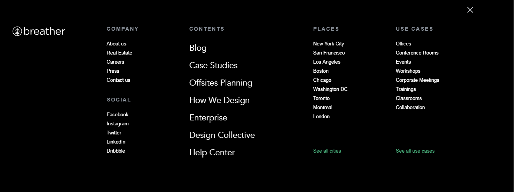
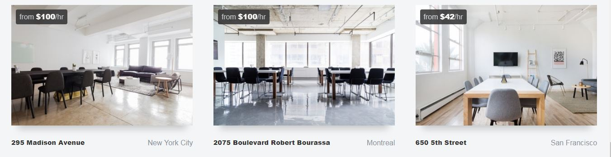
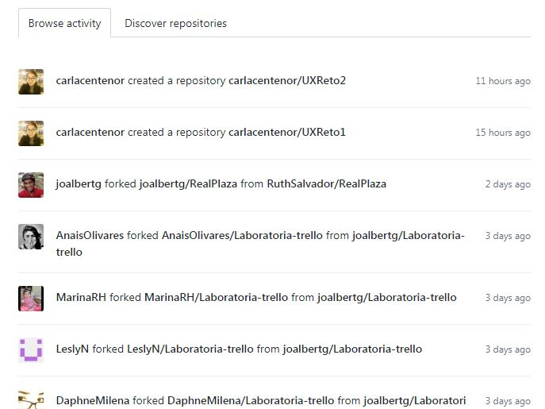
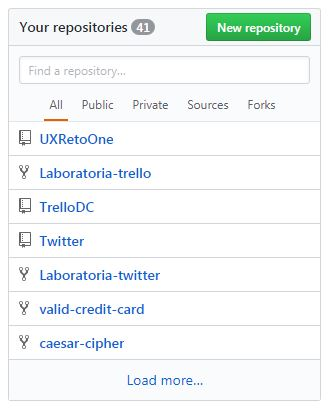
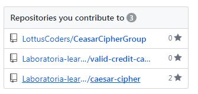
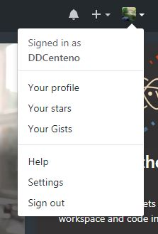
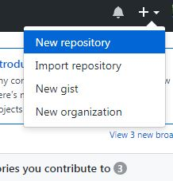
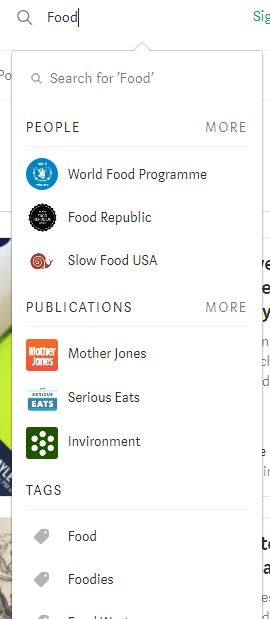

## Breather
___
Tipos de Navegación :
* Global: Al hacer click en la opcion Menu del lado derecho saldra el siguiente menu.

* Contextual: Nos sugiere unas opciones de rooms con precio incluido

## GitHub
___
Tipos de Navegación :
* Facetada: Nos da una navegación segun los filtros del menu general. 

* Facetada y Contextual: Nos da dos opciones de navegado ya sea las actividades de los que sigues o descubrir otros repositoris y contextual porque nos da las ultimas tareas que han realizado a los que seguimos.

* Facetada y filtrada: Nos da opciones de navegado dentro de los repositorios que se creo y filtrada porque da al usuario una barra donde se puede buscar por nombre de repositorio.

;

;

* Local: Navegación del usuario con cosas solo propias de lo que puede hacer él.

 

## Medium
___
Tipos de Navegación:
* Global: Navegación principal de la pagina

* Filtrada: Navegación segun busqueda propia del usuario y se entrega filtros de las publicaciones segun lo que se escriba.

